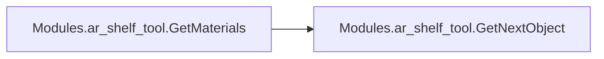
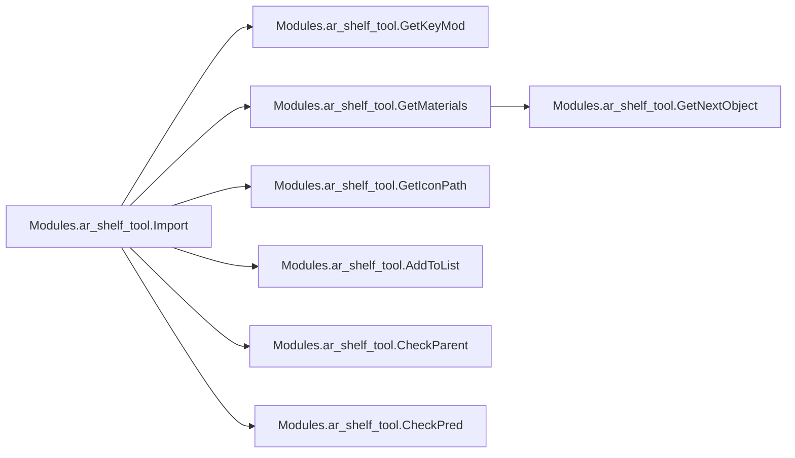

# Modules Ar Shelf Tool

[_Documentation generated by Documatic_](https://www.documatic.com)

<!---Documatic-section-Codebase Structure-start--->
## Codebase Structure

<!---Documatic-block-system_architecture-start--->
```mermaid
None
```
<!---Documatic-block-system_architecture-end--->

# #
<!---Documatic-section-Codebase Structure-end--->

<!---Documatic-section-Modules.ar_shelf_tool.GetKeyMod-start--->
## Modules.ar_shelf_tool.GetKeyMod

<!---Documatic-section-GetKeyMod-start--->
<!---Documatic-block-Modules.ar_shelf_tool.GetKeyMod-start--->
<details>
	<summary><code>Modules.ar_shelf_tool.GetKeyMod</code> code snippet</summary>

```python
def GetKeyMod():
    bc = c4d.BaseContainer()
    keyMod = 'None'
    if c4d.gui.GetInputState(c4d.BFM_INPUT_KEYBOARD, c4d.BFM_INPUT_CHANNEL, bc):
        if bc[c4d.BFM_INPUT_QUALIFIER] & c4d.QSHIFT:
            if bc[c4d.BFM_INPUT_QUALIFIER] & c4d.QCTRL:
                if bc[c4d.BFM_INPUT_QUALIFIER] & c4d.QALT:
                    keyMod = 'Alt+Ctrl+Shift'
                else:
                    keyMod = 'Ctrl+Shift'
            elif bc[c4d.BFM_INPUT_QUALIFIER] & c4d.QALT:
                keyMod = 'Alt+Shift'
            else:
                keyMod = 'Shift'
        elif bc[c4d.BFM_INPUT_QUALIFIER] & c4d.QCTRL:
            if bc[c4d.BFM_INPUT_QUALIFIER] & c4d.QALT:
                keyMod = 'Alt+Ctrl'
            else:
                keyMod = 'Ctrl'
        elif bc[c4d.BFM_INPUT_QUALIFIER] & c4d.QALT:
            keyMod = 'Alt'
        else:
            keyMod = 'None'
        return keyMod
```
</details>
<!---Documatic-block-Modules.ar_shelf_tool.GetKeyMod-end--->
<!---Documatic-section-GetKeyMod-end--->

# #
<!---Documatic-section-Modules.ar_shelf_tool.GetKeyMod-end--->

<!---Documatic-section-Modules.ar_shelf_tool.CheckParent-start--->
## Modules.ar_shelf_tool.CheckParent

<!---Documatic-section-CheckParent-start--->
<!---Documatic-block-Modules.ar_shelf_tool.CheckParent-start--->
<details>
	<summary><code>Modules.ar_shelf_tool.CheckParent</code> code snippet</summary>

```python
def CheckParent(op):
    if op.GetUp() != None:
        return op.GetUp()
    else:
        return None
```
</details>
<!---Documatic-block-Modules.ar_shelf_tool.CheckParent-end--->
<!---Documatic-section-CheckParent-end--->

# #
<!---Documatic-section-Modules.ar_shelf_tool.CheckParent-end--->

<!---Documatic-section-Modules.ar_shelf_tool.CheckPred-start--->
## Modules.ar_shelf_tool.CheckPred

<!---Documatic-section-CheckPred-start--->
<!---Documatic-block-Modules.ar_shelf_tool.CheckPred-start--->
<details>
	<summary><code>Modules.ar_shelf_tool.CheckPred</code> code snippet</summary>

```python
def CheckPred(op):
    if op.GetPred() != None:
        return op.GetPred()
    else:
        return None
```
</details>
<!---Documatic-block-Modules.ar_shelf_tool.CheckPred-end--->
<!---Documatic-section-CheckPred-end--->

# #
<!---Documatic-section-Modules.ar_shelf_tool.CheckPred-end--->

<!---Documatic-section-Modules.ar_shelf_tool.GetNextObject-start--->
## Modules.ar_shelf_tool.GetNextObject

<!---Documatic-section-GetNextObject-start--->
<!---Documatic-block-Modules.ar_shelf_tool.GetNextObject-start--->
<details>
	<summary><code>Modules.ar_shelf_tool.GetNextObject</code> code snippet</summary>

```python
def GetNextObject(op):
    if op == None:
        return None
    if op.GetDown():
        return op.GetDown()
    while not op.GetNext() and op.GetUp():
        op = op.GetUp()
    return op.GetNext()
```
</details>
<!---Documatic-block-Modules.ar_shelf_tool.GetNextObject-end--->
<!---Documatic-section-GetNextObject-end--->

# #
<!---Documatic-section-Modules.ar_shelf_tool.GetNextObject-end--->

<!---Documatic-section-Modules.ar_shelf_tool.GetMaterials-start--->
## Modules.ar_shelf_tool.GetMaterials

<!---Documatic-section-GetMaterials-start--->


### Object Calls

* Modules.ar_shelf_tool.GetNextObject

<!---Documatic-block-Modules.ar_shelf_tool.GetMaterials-start--->
<details>
	<summary><code>Modules.ar_shelf_tool.GetMaterials</code> code snippet</summary>

```python
def GetMaterials(op):
    texTags = []
    materials = []
    if op is None:
        return
    while op:
        tags = op.GetTags()
        for tag in tags:
            if tag.GetType() == 5616:
                mat = tag[c4d.TEXTURETAG_MATERIAL]
                if mat != None:
                    texTags.append(tag)
                    materials.append(mat)
        op = GetNextObject(op)
    return (texTags, materials)
```
</details>
<!---Documatic-block-Modules.ar_shelf_tool.GetMaterials-end--->
<!---Documatic-section-GetMaterials-end--->

# #
<!---Documatic-section-Modules.ar_shelf_tool.GetMaterials-end--->

<!---Documatic-section-Modules.ar_shelf_tool.AddToList-start--->
## Modules.ar_shelf_tool.AddToList

<!---Documatic-section-AddToList-start--->
<!---Documatic-block-Modules.ar_shelf_tool.AddToList-start--->
<details>
	<summary><code>Modules.ar_shelf_tool.AddToList</code> code snippet</summary>

```python
def AddToList(asset, target):
    global generators
    global deformers
    global forces
    global effectors
    global fields
    if asset.GetType() in effectors:
        if target.GetType() in generators:
            if target.GetType() in [1018544, 1018791, 1018545, 1018957, 1019358, 1019222]:
                effectorsList = target[c4d.ID_MG_MOTIONGENERATOR_EFFECTORLIST]
                effectorsList.InsertObject(asset, 1)
                target[c4d.ID_MG_MOTIONGENERATOR_EFFECTORLIST] = effectorsList
            elif target.GetType() == 440000054:
                effectorsList = target[c4d.MGMOSPLINEOBJECT_EFFECTORLIST]
                effectorsList.InsertObject(asset, 1)
                target[c4d.MGMOSPLINEOBJECT_EFFECTORLIST] = effectorsList
            elif target.GetType() == 1036557:
                effectorsList = target[c4d.ID_MG_VF_MOTIONGENERATOR_EFFECTORLIST]
                effectorsList.InsertObject(asset, 1)
                target[c4d.ID_MG_VF_MOTIONGENERATOR_EFFECTORLIST] = effectorsList
            elif target.GetType() == 1019268:
                effectorsList = target[c4d.MGTEXTOBJECT_EFFECTORLIST_CHAR]
                effectorsList.InsertObject(asset, 1)
                target[c4d.MGTEXTOBJECT_EFFECTORLIST_CHAR] = effectorsList
            else:
                pass
    elif asset.GetType() in fields:
        if target.GetType() in effectors or target.GetType() in deformers:
            fieldLayer = c4d.modules.mograph.FieldLayer(c4d.FLfield)
            fieldLayer.SetLinkedObject(asset)
            fieldLayer.SetBlendingMode(c4d.ID_FIELDLAYER_BLENDINGMODE_LIGHTEN)
            fieldList = target[c4d.FIELDS]
            fieldList.InsertLayer(fieldLayer)
            target[c4d.FIELDS] = fieldList
        elif target.GetType() in forces:
            if target.GetType() == 1041451:
                fieldLayer = c4d.modules.mograph.FieldLayer(c4d.FLfield)
                fieldLayer.SetLinkedObject(asset)
                fieldLayer.SetBlendingMode(c4d.ID_FIELDLAYER_BLENDINGMODE_LIGHTEN)
                fieldList = target[c4d.ID_FIELDFORCE_FIELDLIST]
                fieldList.InsertLayer(fieldLayer)
                target[c4d.FIELDS] = fieldList
            else:
                fieldLayer = c4d.modules.mograph.FieldLayer(c4d.FLfield)
                fieldLayer.SetLinkedObject(asset)
                fieldLayer.SetBlendingMode(c4d.ID_FIELDLAYER_BLENDINGMODE_LIGHTEN)
                fieldList = target[c4d.FIELDS]
                fieldList.InsertLayer(fieldLayer)
                target[c4d.FIELDS] = fieldList
    return
```
</details>
<!---Documatic-block-Modules.ar_shelf_tool.AddToList-end--->
<!---Documatic-section-AddToList-end--->

# #
<!---Documatic-section-Modules.ar_shelf_tool.AddToList-end--->

<!---Documatic-section-Modules.ar_shelf_tool.GetIconPath-start--->
## Modules.ar_shelf_tool.GetIconPath

<!---Documatic-section-GetIconPath-start--->
<!---Documatic-block-Modules.ar_shelf_tool.GetIconPath-start--->
<details>
	<summary><code>Modules.ar_shelf_tool.GetIconPath</code> code snippet</summary>

```python
def GetIconPath(scriptPath):
    iconPath = scriptPath.rsplit('.', 1)[0] + '.tif'
    return iconPath
```
</details>
<!---Documatic-block-Modules.ar_shelf_tool.GetIconPath-end--->
<!---Documatic-section-GetIconPath-end--->

# #
<!---Documatic-section-Modules.ar_shelf_tool.GetIconPath-end--->

<!---Documatic-section-Modules.ar_shelf_tool.Import-start--->
## Modules.ar_shelf_tool.Import

<!---Documatic-section-Import-start--->


### Object Calls

* Modules.ar_shelf_tool.GetKeyMod
* Modules.ar_shelf_tool.GetMaterials
* Modules.ar_shelf_tool.GetIconPath
* Modules.ar_shelf_tool.AddToList
* Modules.ar_shelf_tool.CheckParent
* Modules.ar_shelf_tool.CheckPred

<!---Documatic-block-Modules.ar_shelf_tool.Import-start--->
<details>
	<summary><code>Modules.ar_shelf_tool.Import</code> code snippet</summary>

```python
def Import(path=None, icon=None, color=None, matsOnly=False):
    if path == None:
        print('No path found!')
        return False
    doc = documents.GetActiveDocument()
    doc.StartUndo()
    keyMod = GetKeyMod()
    selection = doc.GetActiveObjects(c4d.GETACTIVEOBJECTFLAGS_NONE)
    tempDoc = documents.BaseDocument()
    flags = c4d.SCENEFILTER_OBJECTS | c4d.SCENEFILTER_MATERIALS | c4d.SCENEFILTER_MERGESCENE
    c4d.documents.MergeDocument(tempDoc, path, flags)
    asset = tempDoc.GetFirstObject()
    (texTags, materials) = GetMaterials(asset)
    if icon != None:
        icon = GetIconPath(icon)
        asset[c4d.ID_BASELIST_ICON_FILE] = icon
    if color != None:
        asset[c4d.ID_BASELIST_ICON_COLORIZE_MODE] = 1
        asset[c4d.ID_BASELIST_ICON_COLOR] = color
    for m in materials:
        doc.InsertMaterial(m, checknames=True)
        doc.AddUndo(c4d.UNDOTYPE_NEWOBJ, m)
    if not matsOnly:
        if len(selection) != 0:
            if keyMod != 'None':
                for s in selection:
                    clone = asset.GetClone()
                    if keyMod == 'Shift':
                        doc.AddUndo(c4d.UNDOTYPE_BITS, s)
                        if s.GetNBit(c4d.NBIT_OM1_FOLD) == False:
                            s.ChangeNBit(c4d.NBIT_OM1_FOLD, c4d.NBITCONTROL_TOGGLE)
                        doc.InsertObject(clone, parent=s, checknames=True)
                        doc.AddUndo(c4d.UNDOTYPE_NEWOBJ, clone)
                    elif keyMod == 'Alt':
                        doc.AddUndo(c4d.UNDOTYPE_CHANGE, s)
                        mat = s.GetMg()
                        parent = CheckParent(s)
                        pred = CheckPred(s)
                        doc.InsertObject(clone, parent=parent, pred=pred, checknames=True)
                        clone.SetMg(mat)
                        s.InsertUnder(clone)
                        doc.AddUndo(c4d.UNDOTYPE_NEWOBJ, clone)
                        s.SetMg(mat)
                    elif keyMod == 'Ctrl':
                        doc.InsertObject(clone, pred=s, checknames=True)
                        clone.SetMg(s.GetMg())
                    doc.AddUndo(c4d.UNDOTYPE_NEWOBJ, clone)
                    AddToList(clone, s)
                asset.Remove()
            else:
                doc.InsertObject(asset, checknames=True)
                doc.AddUndo(c4d.UNDOTYPE_NEWOBJ, asset)
                for s in selection:
                    AddToList(asset, s)
        else:
            doc.InsertObject(asset, checknames=True)
            doc.AddUndo(c4d.UNDOTYPE_NEWOBJ, asset)
        for s in selection:
            s.DelBit(c4d.BIT_ACTIVE)
            doc.AddUndo(c4d.UNDOTYPE_BITS, s)
    documents.KillDocument(tempDoc)
    c4d.EventAdd()
    doc.EndUndo()
    return True
```
</details>
<!---Documatic-block-Modules.ar_shelf_tool.Import-end--->
<!---Documatic-section-Import-end--->

# #
<!---Documatic-section-Modules.ar_shelf_tool.Import-end--->

[_Documentation generated by Documatic_](https://www.documatic.com)